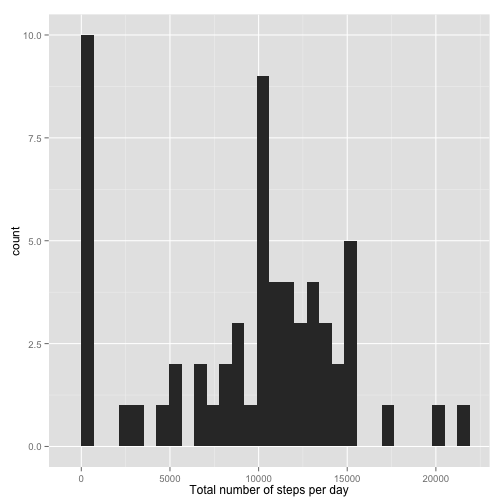
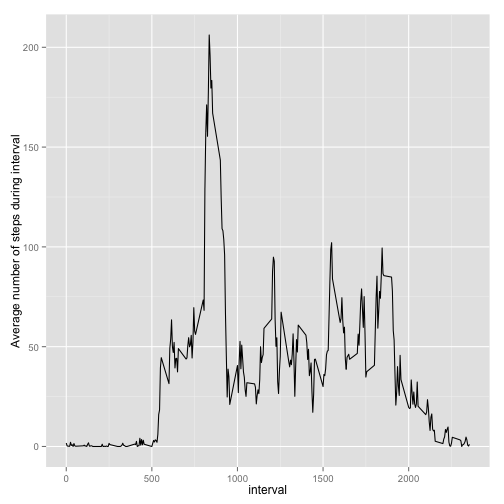
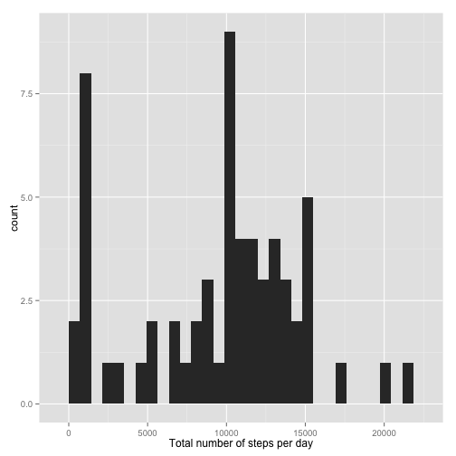
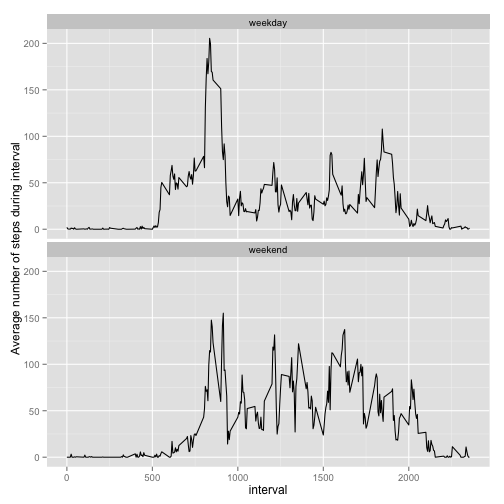

Reproducible Research, Peer Assessment 1
========================================================


In this assignment we will analyse data from a personal activity monitoring device. We are given a data file with records of the number of steps taken in each of a number of five-minute intervals for each day during two months. We start by loading the data:


```r
activity.data <- read.csv("activity.csv", header = TRUE)
dim(activity.data)
```

```
## [1] 17568     3
```

```r
head(activity.data)
```

```
##   steps       date interval
## 1    NA 2012-10-01        0
## 2    NA 2012-10-01        5
## 3    NA 2012-10-01       10
## 4    NA 2012-10-01       15
## 5    NA 2012-10-01       20
## 6    NA 2012-10-01       25
```


For some five-minute intervals, no data on the number of steps is available. These missing values will be imputed later. For the first parts of the exercise, we consider only the non-missing values.

### Histogram of number of steps per day

We start by calculating the total number of steps taken each day, and constructing a histogram of these values. 

```r
library(plyr)
library(ggplot2)
sum.by.date <- ddply(activity.data, .(date), 
                     summarize, totsteps = sum(steps, na.rm = TRUE))
dim(sum.by.date)  ## One line per day
```

```
## [1] 61  2
```

```r
head(sum.by.date)
```

```
##         date totsteps
## 1 2012-10-01        0
## 2 2012-10-02      126
## 3 2012-10-03    11352
## 4 2012-10-04    12116
## 5 2012-10-05    13294
## 6 2012-10-06    15420
```

```r
print(ggplot(sum.by.date, aes(x = totsteps)) + 
        geom_histogram() + xlab("Total number of steps per day")) 
```

 


We also compute the mean and the median number of steps per day.

```r
mean.nbr.steps <- round(mean(sum.by.date$totsteps, na.rm = TRUE), digits = 0)  ## mean
median.nbr.steps <- median(sum.by.date$totsteps, na.rm = TRUE)  ## median
mean.nbr.steps
```

```
## [1] 9354
```

```r
median.nbr.steps
```

```
## [1] 10395
```


### Activity pattern during the day
Next, we make a time-series plot showing the mean activity pattern for each five-minute interval across the days.

```r
av.by.interval <- ddply(activity.data, .(interval), summarize, 
                        meansteps = mean(steps, na.rm = TRUE))
dim(av.by.interval)  ## one line per 5-min interval 
```

```
## [1] 288   2
```

```r
head(av.by.interval)
```

```
##   interval meansteps
## 1        0   1.71698
## 2        5   0.33962
## 3       10   0.13208
## 4       15   0.15094
## 5       20   0.07547
## 6       25   2.09434
```

```r
print(ggplot(av.by.interval, aes(x = interval, y = meansteps)) + 
        geom_line() + ylab("Average number of steps during interval"))
```

 


We compute the five-minute interval with the largest average number of steps.

```r
max.interval <- av.by.interval$interval[which.max(av.by.interval$meansteps)]
max.interval
```

```
## [1] 835
```


## Imputing missing values
For some days/intervals, there are missing values for the number of steps. We start by counting the total number of missing values.

```r
sum(is.na(activity.data$steps))
```

```
## [1] 2304
```


We impute the missing values by replacing them with the median number of steps for the corresponding five-minute interval across the whole data set.

```r
activity.data.noNA <- activity.data
w <- which(is.na(activity.data$steps))
for (i in w) {
  activity.data.noNA[i, "steps"] <- 
    median(activity.data$steps[activity.data$interval == 
                                 activity.data[i, "interval"]], na.rm = TRUE)
  }
```

We check that there are no missing values in the new data set


```r
sum(is.na(activity.data.noNA$steps))
```

```
## [1] 0
```

```r
head(activity.data.noNA)
```

```
##   steps       date interval
## 1     0 2012-10-01        0
## 2     0 2012-10-01        5
## 3     0 2012-10-01       10
## 4     0 2012-10-01       15
## 5     0 2012-10-01       20
## 6     0 2012-10-01       25
```


For the data set with imputed values, we again make a histogram of the total number of steps taken per day, as well as compute the mean and the median of these numbers.


```r
sum.by.date.noNA <- ddply(activity.data.noNA, .(date), 
                          summarize, totsteps = sum(steps, na.rm = TRUE))
print(ggplot(sum.by.date.noNA, aes(x = totsteps)) + geom_histogram() +
         xlab("Total number of steps per day")) 
```

 

```r
mean.nbr.steps.noNA <- round(mean(sum.by.date.noNA$totsteps, na.rm = TRUE), digits = 0)
median.nbr.steps.noNA <- median(sum.by.date.noNA$totsteps, na.rm = TRUE)
mean.nbr.steps.noNA
```

```
## [1] 9504
```

```r
median.nbr.steps.noNA
```

```
## [1] 10395
```


The imputation of the missing values did not drastically change the summary statistics.

## Are there differences in activity patterns between weekdays and weekends?
Finally, we will plot the mean activity pattern across weekdays and weekends separately. First, we create a new factor giving the type of day for each line.

```r
activity.data.noNA$daytype <- 
  factor(c("weekday", "weekend")[1 + (weekdays(as.Date(activity.data.noNA$date)) %in% 
                                        c("Saturday", "Sunday"))])
table(activity.data.noNA$daytype)
```

```
## 
## weekday weekend 
##   12960    4608
```

```r
head(table(activity.data.noNA$date, activity.data.noNA$daytype), n = 7)
```

```
##             
##              weekday weekend
##   2012-10-01     288       0
##   2012-10-02     288       0
##   2012-10-03     288       0
##   2012-10-04     288       0
##   2012-10-05     288       0
##   2012-10-06       0     288
##   2012-10-07       0     288
```


Then, we plot the mean activity pattern across the day for weekdays and weekends separately.

```r
av.by.interval.noNA <- ddply(activity.data.noNA, .(interval, daytype), summarize, 
                             meansteps = mean(steps, na.rm = TRUE))
head(av.by.interval.noNA)
```

```
##   interval daytype meansteps
## 1        0 weekday    2.0222
## 2        0 weekend    0.0000
## 3        5 weekday    0.4000
## 4        5 weekend    0.0000
## 5       10 weekday    0.1556
## 6       10 weekend    0.0000
```

```r
print(ggplot(av.by.interval.noNA, aes(x = interval, y = meansteps)) + 
        geom_line() + facet_wrap(~ daytype, nrow = 2) + 
        ylab("Average number of steps during interval"))
```

 


  
